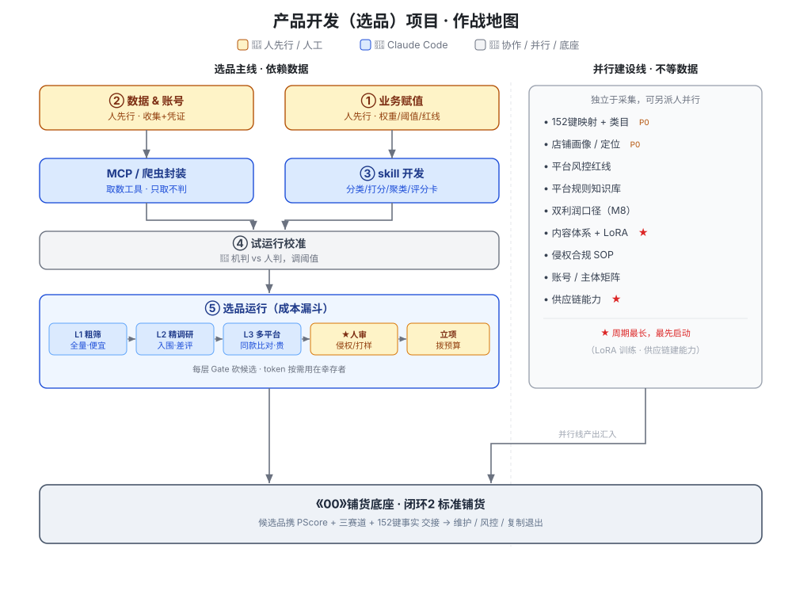

# 产品开发（选品）项目 · 作战地图总纲

> 版本 V1.0　日期 2026-06-24　主类目：女装　目标平台：Amazon / TikTok Shop / Shein（D4）
> 本文整合：数据源采集立项 + 选品全流程 + 人机分工 + 推进路径 + 并行工作流。
> 图例：🤖 Claude Code / 机器自动　👤 人工判断　🤝 协作（人定规则·机器执行）

---

## 0. 定位：本文 vs《00 铺货总纲》

《00 总纲》是**铺货运营底座**，起点是闭环1「选品进入」。本文是**它的上游**——产品开发/选品，负责把候选品打磨成带着 `Priority Score + 三赛道标签 + 152键事实` 的成品，交接进闭环2 铺货。

```
本文（产品开发/选品）           《00》铺货底座
数据源→三赛道→PScore→152键  ──交接──▶  闭环2 标准铺货 → 维护 → 风控 → 复制/退出
```

---

## 1. 全景一张图

```
        ┌─────────── 选品主线（依赖数据） ───────────┐
        │ ①赋值(人) ②数据/账号(人) → MCP/爬虫 → skill │
        │   → 取数→打分→改良→评分卡 → 人审 → 立项     │──┐
        └──────────────────────────────────────────┘  │
                                                        ├─▶ 交接进《00》闭环2 铺货
        ┌─────── 并行建设线（不依赖选品数据） ───────┐  │
        │ 152键映射 / 双利润口径 / 内容+LoRA /        │──┘
        │ 供应链能力 / 合规侵权 / 店铺画像 / 平台知识库 │
        └──────────────────────────────────────────┘
```

两条线**可同时开工**：选品主线要等数据，并行建设线现在就能动。

---

## 2. 产品开发三种模式（女装）

| 模式 | 做什么 | 152键事实来源 | 人工轻重 | 侵权风险 |
|---|---|---|---|---|
| 选品 | 直接挑已验证的款去铺 | 前台+自有库，**大部分可直接填** | 最轻（打样可跳过） | 低 |
| 改款 | 爆款 + 差评聚类找痛点 → 改面料/版型/细节 | 参考款从前台得，**改良点打样后填实** | 中 | 中（避外观专利+自训练LoRA出图） |
| 新品 | 顺趋势元素设计全新款 | 前台只给参考，**事实靠设计+打样填实** | 最重 | 需自查 R3 四项 |

→ 三模式差别在 152键"可直接填充率"：选品最高、新品最低，决定每轮机器能独立跑多远。

> **现实前提**：同一款服装常被多卖家、在 Amazon/TK/Shein 多平台同时上架；我们后期刊登也是多平台。因此选品验证必须做**跨平台比对**（见 5.4），且因成本高，只对终选款做（见 5.3 分层漏斗）。

---

## 3. 核心契约链（产品开发 ↔ 铺货底座的对接边界）

```
数据源                  三赛道              Priority Score 输入        产出
卖家精灵(MCP)        ┐ 趋势(上升元素)┐  市场维度: 容量·增长
 搜索量/趋势/销量     ├▶爆款(成熟高销)┼▶竞争维度: 集中度·可突破·价格甜区 ┐
 竞争集中度/价格带    │ 长尾(细分低竞)┘  产品维度: 改良空间·差异化      ├▶PScore
前台爬取             │   ↑赛道只调权重    自有维度: 供应链·毛利·起订   ┘   │分箱
 listing(→152键事实) │    进同一公式(A10)                                  ▼
 差评全文(→改良清单)  ┘                                          S/A/B/C候选
自有: 打样成本/款库/动销 ──────────────────────────────▶ 立项Project+Canonical 152键
```

---

## 4. 数据源采集（立项目标）

**目标**：盘清、采集、封装选品所需全部可获取数据源，固化成可被 skill 消费的结构化数据与 MCP，并明确缺口。
**成功标准**：跑通一条真实端到端样例（关键词 → 各源数据 → PScore → 候选 + 152键）。

### 4.1 五域分工

| 组 | 域 | 产出 |
|---|---|---|
| 工具组 | 第三方工具 | 账号/配额盘点 + 卖家精灵 MCP 封装 |
| 爬取组 | 前台爬取 | 三平台采集脚本 + **差评全文批量获取** |
| 趋势组 | 社媒情报 | 趋势热词/元素采集方案 |
| 供应链组 | 自有&供应链 | 现有数据导出 + 成本/MOQ/退货原因结构化 |
| 合规组 | 侵权 | 商标/专利/平台政策查询通道 |

### 4.2 优先级
- **P0**：卖家精灵 + Amazon 前台爬取（含差评）——数据最成熟、对应样板 D4。
- **P1**：TikTok/Shein 前台 + 社媒趋势 + 自有/供应链。
- **P2**：合规侵权通道 + 趋势工具深度接入。

### 4.3 关键缺口判断
- **Shein 量化数据**是最大缺口（第三方工具稀缺）→ 靠前台爬 + 社媒补。
- **女装趋势工具偏贵**（WGSN/Heuritech）→ 前期先用 Google Trends + 小红书/Pinterest 免费补。
- **差评全文**拿不到 → "改款"模式不成立，列入缺口优先攻关。

> 完整数据源案例库见**附录 A**。

---

## 5. 选品全流程 + 人机分工

### 5.1 运行期循环（漏斗式，一张图）

> 核心原则：**分层按需，越往后越贵，每层都砍候选**——绝不对每款都做全量调研。

```
L1 粗筛(全量·便宜) → L2 精调研(仅入围·中) → L3 多平台比对(仅终选·贵) → ★人工审核 → 立项
🤖批量量价数据         🤖差评聚类+改良+评分卡    🤖跨平台同款多卖家比对     👤go/no-go    👤打样
🤖三赛道+PScore初排     仅 S/A/B 进              仅终选 S/A 进            👤侵权确认    🤖填152键→交铺货
  ↓砍掉大部分             ↓再砍                    ↓                     └─回流校准🤝─┘
```

### 5.2 运行期节点表（标注层级与成本）

| # | 节点 | 执行 | 层·成本 | 说明 |
|---|---|---|---|---|
| 1 | 取数粗筛：榜单+工具批量量价数据 | 🤖 | **L1 全量·低** | 调 MCP 批量，不爬全文 |
| 2 | 三赛道分类 | 🤖 | L1 | 候选打标签 |
| 3 | PScore 打分 → S/A/B/C 初排 | 🤖 | L1 | **砍掉大部分候选** |
| ⛳ | Gate：仅 S/A/B 进 L2 | 🤖 | — | 低分直接淘汰，省 token |
| 4 | 差评全文聚类 → 改良清单 | 🤖 | **L2 入围·中** | token 贵，按需才爬全文 |
| 5 | 单平台精算 + 评分卡 + 标红 | 🤖 | L2 | 入围候选的成品 |
| ⛳ | Gate：仅终选 S/A 进 L3 | 🤖 | — | 再淘汰一批 |
| 6 | **★多平台数据比对**（同款多卖家 × Amazon/TK/Shein） | 🤖 | **L3 终选·高** | 验证环节，**与刊登店货匹配重叠**（见 5.4） |
| 7 | **★审核：市场/竞争/差异化/毛利** | 👤 | — | go/no-go 核心拍板 |
| 8 | **★侵权确认**（R3 四项） | 👤 | — | 过不了直接砍 |
| 9 | **★改款/新品打样决策与执行** | 👤+供应链 | — | 选品模式可跳过 |
| 10 | 152键事实填充 | 🤝 | — | 🤖填可得，👤补打样实测 |
| 11 | 立项 Project + 拨预算 | 👤 | — | 进决策容器 |
| 12 | 交接进铺货底座（闭环2） | 🤖 | — | 系统流转 |

### 5.3 成本控制：分层按需调研（控 token）

现实是候选量极大、铺货又是多平台规模化，**不可能对每款都做大量调用**。所以调研做成**漏斗**，每层有 Gate，只有幸存者才消耗更贵的下一层：

| 层 | 对谁做 | 取什么 | 成本 | 设计要点 |
|---|---|---|---|---|
| **L1 粗筛** | 全量候选 | 榜单 + 工具的**批量量价指标**（销量/价格/竞争度/搜索量） | 低 | 只走 MCP 批量接口，**不爬差评全文、不跨平台**，纯量化砍量 |
| **L2 精调研** | 仅 L1 入围（S/A/B） | **差评全文聚类**、改良清单、单平台精算 | 中 | 爬全文/LLM 聚类是 token 大头，**只对入围款做** |
| **L3 多平台比对** | 仅 L2 终选（S/A） | 跨三平台同款多卖家比对（见 5.4） | 高 | 最贵，**只对要立项的少数款做** |

> 规则化阈值（待赋值）：每层的"放行分数线"由 PScore 阈值控制，分数线越严、进入下层的越少、越省钱。这几个阈值是**成本与漏检的权衡旋钮**，归入待拍板清单。

### 5.4 ★多平台数据比对（验证环节，与刊登重叠）

**现实**：同一款服装，往往多个卖家、在 Amazon/TikTok/Shein 多平台都上架；我们后期刊登也是多平台规模化。所以对终选款，单看一个平台会失真——必须做**跨平台比对**。

**比对什么**（同款/同类目跨三平台）：
- 各平台的销量/价格带/竞争集中度差异 → 判断**哪个平台更值得铺、哪个已饱和**。
- 同款多卖家分布 → 判断红海程度与差异化空间。
- 各平台差评共性 vs 平台特异痛点 → 改良点是否通用。
- 各平台合规/侵权环境差异。

**与刊登重叠（做一次、用两次）**：这套跨平台比对的产出（各平台竞争/价格/饱和度），正是《00》**闭环2/3 铺货的"货选店 / 店货匹配"**所需的输入。所以在选品验证环节算出来的结论，**直接沉淀复用到刊登环节**，不重复调研——这也是省成本的关键。

> 落地：多平台比对 skill 的输出结构，对齐铺货侧"店货匹配"的输入字段，让选品产出能被刊登直接消费。

#### 5.4.1 同款的三粒度（一次比对、三层分组）

| 粒度 | 定义 | 主判据 | 喂给 |
|---|---|---|---|
| **L1 同货源** | 同供应商同实物，不同卖家/listing | pHash 近重复 + 规格高度一致 + 价格接近 | 红海/价格战、多少卖家铺同批货 |
| **L2 同款式** | 同设计（廓形+领+袖+衣长+门襟+结构），**可不同色/印花/面料** | 选品口径属性匹配 + 视觉 embedding | 市场容量、差异化空间 |
| **L3 同微趋势** | 同一流行**元素**（如泡泡袖+碎花） | 趋势口径元素命中 | 趋势赛道体量 |

#### 5.4.2 款识别性属性集（女装·两套口径，推荐值）

> **选品口径＝款型中心**（判 L1/L2，色/印花算变体）；**趋势口径＝元素中心**（判 L3，趋势元素算身份）。
> 品类必须先一致（gate），否则不进比对。下装无领/袖时权重按比例归一。
> **状态：已采用为起始基线 v0，待试运行用真实数据校准。**

**选品口径——识别性属性（变了就不是同款）**

| 属性 | 推荐权重 | 来源 | 备注 |
|---|---|---|---|
| 品类（连衣裙/上衣/半裙/裤/外套…） | **gate** | 标题/类目 | 不一致不比 |
| 廓形/版型（A字/H/X/直筒/修身/oversize） | 20 | CV+规格 | 款型主骨架 |
| 领型（圆/V/方/翻/一字肩/立领） | 15 | CV+标题 | 上装重点 |
| 袖型+袖长（无/短/泡泡/灯笼/长…） | 15 | CV+标题 | 上装重点 |
| 衣长/裙长/裤长（迷你/及膝/midi/maxi） | 15 | CV+规格 | |
| 门襟/开合（套头/单排扣/拉链/系带） | 10 | CV+规格 | |
| 腰型（高/中/松紧/收腰） | 10 | CV+规格 | 下装重点 |
| 关键结构细节（开衩/抽褶/荷叶边/拼接） | 10 | CV | 仅"设计定义性"细节 |
| 面料大类（针织/梭织/牛仔/雪纺/蕾丝） | 5 | 规格+CV | 针织vs梭织算不同款 |

**变体属性（不计入选品口径）**：颜色、具体印花图案、克重微差、装饰小料、尺码。

**趋势口径——在选品口径外追加这些为"身份元素"（命中即归同趋势簇，一款可属多簇）**

| 趋势元素 | 例 |
|---|---|
| 颜色（年度流行色） | 巴黎雾霾蓝、奶油色… |
| 图案主题 | 碎花/格纹/波点/动物纹 |
| 袖/领标志元素 | 泡泡袖、方领、挂脖 |
| 工艺细节 | 镂空、木耳边、抽绳、拼蕾丝 |
| 长度趋势 | 超短、maxi |

> 趋势口径更看"元素"而非完整款型——"泡泡袖"跨多种连衣裙都算同趋势；所以判 L3 时**命中 ≥1 个强趋势元素即归簇**，不要求款型整体一致。

#### 5.4.3 匹配流水线与判定（成本可控，贴合漏斗）

1. **召回（便宜）**：按 品类+关键属性+关键词 缩小每平台候选集，**不做 all-pairs**。
2. **粗匹配**：算 视觉 embedding 相似度 + 选品口径属性加权匹配分。
3. **判定**：
   - **L1**：pHash 近重复 或（属性近满分 + embedding 极高 + 价差小）。
   - **L2**：属性加权分 ≥ 阈值（建议起点 70，品类必中）**且** embedding ≥ 阈值（建议 0.8）。
   - **L3**：趋势口径命中 ≥1 个强元素即归簇。
4. **边界复核**：仅分数落在阈值带的少数款丢给 LLM 视觉最终判定（贵、量可控，对应"标红存疑→人工"）。
5. **归一**：全程属性归一到 Canonical 152键词表（t_value_dict），解决跨平台/跨语言不一致，并与铺货"店货匹配"共用一套属性语言。

> **已采用上述推荐值为起始基线 v0**（属性权重、L2 属性分线 70 / embedding 0.8、L1 价差容差、趋势元素清单），由步骤④试运行用真实数据校准（见 5.5）。

### 5.5 回馈校准
| 节点 | 执行 | 说明 |
|---|---|---|
| 表现回流 → 校准 PScore 权重 | 🤝 | 🤖跑回归建议，👤确认调权 |
| 改款效果回流 → 修正严重度口径 | 🤝 | 同上 |
| 各层 Gate 阈值回流 → 调成本/漏检平衡 | 🤝 | 🤖给漏检率，👤定松紧 |

---

## 6. 推进路径（实施步骤与人机接力）

> 总原则：**人提供（规则+数据+凭证）→ CC 建造 → 人验收 → 进下一步**。

| 步骤 | 谁先动 | 👤 人做 | 🤖 CC 做 | 🚦 Gate |
|---|---|---|---|---|
| ① 对齐赋值 | 人先行 | PScore 权重框架、改款严重度口径、毛利/MOQ 红线；确认 152键映射+三赛道规则 | 整理成可执行规格，标 TODO | 有"规则与赋值清单"，skill 才有依据 |
| ② 采集+MCP封装 | 人先行 | 收集数据源、开账号/配额、给凭证、定爬取红线 | 封装 MCP、写爬虫、调一次核对真实字段 | 能稳定取到四类数据 |
| ③ 引擎/skill 开发 | CC 为主 | 抽样审逻辑 | 写四个 skill（分类/打分/聚类/评分卡） | 端到端样例跑通 |
| ④ 试运行校准 | 人机配合 | 审结果、标错判 | 跑真实批次出评分卡 | 机判与人判吻合度达标 |
| ⑤ 常态运行 | CC 跑 | 只守四关键点 | 全自动取数→打分→改良→评分卡 | 稳定选品产能 |

### 阻塞关系
```
①赋值(人) ──┐
            ├─▶ ③skill开发(CC) ─▶ ④试运行校准(人机) ─▶ ⑤常态运行
②数据/账号(人)─▶ MCP封装(CC) ─┘
```
**两个"人先行"瓶颈**：①业务赋值、②账号与数据。不给到位 CC 全卡住，但**两者可并行**（一组定规则、一组开账号收数据）。

---

## 7. 并行工作流（独立于采集，现在就能开）

这些是人工判断/业务赋值，**不依赖选品数据**，可另派人并行：

| # | 工作流 | 执行 | 为何独立 | 紧迫度 |
|---|---|---|---|---|
| A | Canonical 152键 + 类目映射确认（附录E，M2/M10） | 👤+🤖 | 铺货底座骨架，纯业务/架构判断 | P0 地基 |
| B | 店铺画像/定位口径（货盘+调性双facet）（M2） | 👤 | 取决于现有店铺矩阵 | P0 |
| C | 各平台风控红线（M7） | 👤 | 纯平台规则配置 | P1 |
| D | 平台规则知识库 | 👤 | 逐平台整理刊登/违禁/活动 | P1 |
| E | 双利润核算口径 + 复制/退出门（M8） | 👤 | 财务/业务判断，钱的闭环 | P2 |
| F | 内容体系框架 + **自训练 LoRA**（M5,D6） | 👤+🤖 | 内容底座；**LoRA 周期长，越早越好** | 优先启动 |
| G | 侵权合规 SOP（R3） | 👤 | 四项判据自查流程 | P1 |
| H | 账号/主体矩阵规划（LegalEntity/Shop） | 👤 | 运营操作 | P1 |
| I | **供应链能力建设**（供应商/打样/面料库） | 👤 | 建能力本身独立；**周期长，优先启动** | 优先启动 |

> 最长周期的两条：**F 的 LoRA 训练** 和 **I 的供应链能力**，建议最先动手。

---

## 8. 主依赖地图（所有线 + 铺货底座）

> 完整可视化版见同目录 `作战地图.svg`（可直接给团队看的作战图）。



下方为纯文本速览版：

```
                        【两个人先行瓶颈，可并行】
  ①业务赋值(人) ┐                            ┌─ A 152键映射 ─┐
                ├─▶③skill(CC)─▶④校准─▶⑤选品运行 │  E 双利润口径  │
  ②数据/账号(人)┘    ↑                       │  F 内容+LoRA★ │─┐
                  MCP/爬虫(CC)                 │  I 供应链★    │ │
                                              │  B/C/D/G/H    │ │
                                              └───并行建设线───┘ │
                                                                 ▼
                                              ┌──────────────────────┐
  选品运行产出(PScore+152键) ──────────────────▶│ 《00》闭环2 标准铺货   │
                                              └──────────────────────┘
   ★ = 周期最长，最先启动
```

---

## 9. 人工介入点总清单（北极星：压到最少）

1. **建设期一次性**：业务赋值（权重/阈值/红线）、验逻辑。
2. **每轮选品**：审核 go/no-go（节点6）。
3. **每个候选**：侵权确认（节点7）、改款/新品打样决策（节点8）。
4. **立项**：拨预算（节点10）。
5. **周期性**：权重校准确认。

其余全 🤖。

---

## 10. 待你拍板清单（汇总）

1. **业务赋值数值**：PScore 三赛道权重、各维度权重、S/A/B/C 分箱阈值；改款严重度口径；毛利红线/MOQ 上限。
2. **分层 Gate 阈值（成本旋钮）**：L1→L2、L2→L3 的放行分数线——越严越省 token、漏检越多，需你权衡。
3. **同款匹配赋值** ✅ 已定：采用 5.4 推荐基线 v0（属性权重 / L2 分线 70 / embedding 0.8 / 趋势元素清单），待数据校准。
3. **采集预算与红线**：TK/Shein 付费工具上不上；爬取合规范围与频率。
4. **团队与排期**：采集项目 P0–P2 节奏；并行建设线（尤其 LoRA、供应链）何时启动、派谁。
5. **模式范围**：三模式（选品/改款/新品）一套统一流程跑，还是先跑"选品+改款"。

---

## 附录 A：数据源案例库（2026-06 核实）

> 标注：✅成熟　💰主要付费　🧩有 Chrome 插件叠加在平台界面　⚠️数据稀缺需自采补

### A1. 第三方软件

**Amazon（最成熟）**

| 工具 | 标注 | 关键能力 | 用途 |
|---|---|---|---|
| 卖家精灵 SellerSprite | ✅💰 | 关键词搜索量·ABA、市场销量/额测算、竞品监控、竞争度、流量来源、Review 趋势 | PScore 市场+竞争主力源 |
| Helium10 | ✅💰 | Black Box 选品、Magnet/Cerebro 关键词、Xray 销量、Review Insights 差评 | 关键词+差评 |
| Jungle Scout | ✅💰 | Opportunity Finder、销量估算、季节性 | 市场容量+季节性 |
| AMZScout / SmartScout | ✅💰 | 选品、品牌&类目份额 | 竞争结构补充 |

**TikTok Shop**

| 工具 | 标注 | 关键能力 | 用途 |
|---|---|---|---|
| Kalodata | ✅💰 | 商品/达人/直播分析，竞品直播逐分钟挂车出单、子类目 AOV | 爆款信号+价格带 |
| FastMoss | ✅💰 | AI 追踪趋势品/爆款视频/达人，按销售效率排达人，趋势识别快 | 趋势赛道+达人 |
| EchoTik | ✅💰🧩 | 早期潜力品；Chrome 插件界面叠预估营收；起步约 $9.9/月有免费档 | 趋势赛道（性价比高） |
| TikTok Creative Center | ✅免费 | 官方热门标签/视频/音乐、趋势词 | 趋势元素 |

**Shein（⚠️工具弱）**：Shein 卖家后台（自营/代运营才有，实时销售分析）；第三方成熟工具少 → 前台榜单爬 + 社媒补。

**时尚趋势预测（女装方向盘，偏贵）**

| 工具 | 标注 | 关键能力 | 用途 |
|---|---|---|---|
| WGSN | ✅💰 | 长周期趋势、色彩预测、7万+模板；2026 加 TikTok Trading + Instock 日追1亿SKU | 新品方向+色彩/版型 |
| Heuritech | ✅💰 | CV 日析 300万+社媒图，识别 2000+属性，可分地区，预测达 24 个月 | 新品趋势+分区域 |
| Google Trends / Pinterest Predicts | ✅部分免费 | 关键词与年度趋势 | 轻量补充 |

### A2. 平台前台爬取
- **Amazon**：Best Sellers / New Releases / Movers&Shakers 榜；listing 详情（标题/五点/A+/主副图/变体/价Coupon/BSR/评分/上架日/品牌）→152键+窗口；评论区**差评全文/带图/Q&A**→改良清单。
- **TikTok Shop**：热销/飙升榜、商品详情、挂车视频与达人、评论。
- **Shein**：品类榜/Trends/New In、商品详情、评分评论、**收藏("加心")数**（Shein 特色爆款信号）、上新节奏。

### A3. 社媒/趋势情报
小红书（穿搭爆文/博主带货，中国审美）｜抖音（达人/BGM/同款）｜TikTok（穿搭 hashtag/挑战，欧美审美）｜Pinterest（配色/版型/Predicts）｜Instagram（博主/Reels）｜快时尚标杆 Zara/H&M/Shein 上新监测。

### A4. 自有 & 供应链
现有款库、历史动销、**退货率与退货原因**（女装主因：版型/尺码/面料/做工/色差）；供应商名录、打样成本、MOQ、生产周期、面料库（克重/弹性）；自家 listing 表现、广告 ACoS、客服高频问题。

### A5. 合规/侵权
商标 USPTO/EUIPO/中国商标网；外观专利各局检索 + 平台 VeRO；各平台违禁词/品牌白名单/AI 图政策 → R3 四项自查。
