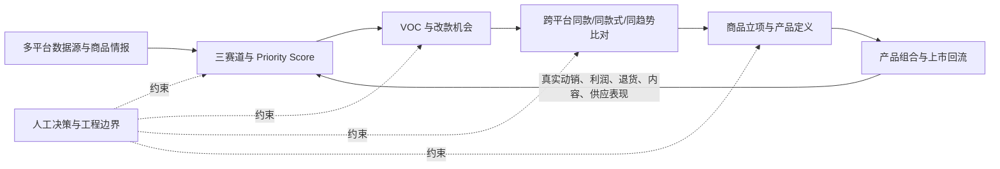

# 开发部大项目 7.13：选品项目全景理解与系统定位

> 文档性质：上位业务蓝图理解稿与当前系统定位稿
> 原始依据：`开发部大项目7.13.xmind`
> 当前系统依据：`04.分级系统`、`06.分级系统数据源`及 2026-07-11 全量运行产物
> 使用对象：业务负责人、产品开发人员、后续改造 Agent
> 本文只定义业务理解和改进边界，不包含代码修改。

## 1. 一句话结论

当前选品系统已经实现了“大项目”中较成熟的**多源候选归一、确定性评分、证据追溯、分层 Gate、推荐表和 Canonical 152 键骨架**，但它仍然只是整个产品开发闭环的中前段能力。

当前最需要纠正的不是某一个阈值，而是系统模型：现行系统把所有商品先强制归入一个主赛道，再用一套共享评分框架和全局深挖名额竞争；目标系统应改成**共享事实底座、三条赛道独立准入、独立补数、独立评分、独立产生 S/A/B、独立控制调研预算**。

## 2. XMind 描述的不是一个评分器，而是一条产品开发闭环

原始脑图的中心目标是：

> 建立从外部市场信号到正式商品项目的多平台产品开发系统，支持“直接选品、爆款改款、趋势新品”三种开发方式，最终交付“产品等级 + 三赛道标签 + 标准产品字段 + 开发决策”。

它包含六个连续子项目和一条工程边界：



因此，`S/A/B` 不是项目终点。它只回答“哪些机会值得继续投入”；正式立项、打样、供应链确认、合规、平台刊登和上市反馈属于后续阶段。

## 3. 必须先拆开的两个概念

XMind 中同时出现了两组三分类：

| 维度 | 脑图用词 | 回答的问题 |
|---|---|---|
| 市场机会赛道 | 趋势、爆款、长尾 | 为什么这个市场机会值得关注 |
| 产品开发方式 | 趋势新品、爆款改款、直接选品 | 公司准备怎样把机会转化为商品 |

两者通常存在默认对应关系：

- 趋势机会通常进入“趋势新品”；
- 已验证需求但痛点明显的商品通常进入“爆款改款”；
- 稳定、分散、可直接承接的需求通常进入“长尾直接选品”。

但它们不应在数据模型中被写成同一个字段。最终采用直接采购、改款还是全新开发，是商品立项阶段的人工作业结果；选品阶段只应输出机会赛道及建议开发方式。

本文后续使用三个业务标签：

1. **趋势新品赛道**：发现新推出的款型和正在形成的风格机会；
2. **爆款改款赛道**：发现已有适量需求、口碑偏低且痛点可改的商品；
3. **长尾直接选品赛道**：发现需求稳定、竞争可切入、无需依赖爆发或明显改款的商品。

## 4. 六个子项目的准确理解

### 4.1 多平台数据源与商品情报项目

目标不是把所有来源强行换算成同一种销量，而是建立统一候选池，并保留各来源的角色和证据。

脑图要求的来源包括：Amazon、TikTok、SHEIN、第三方工具、社媒趋势、自有商品库和供应链数据。不同来源承担的任务不同：

- 独立站、品牌站、时尚零售站：发现新款型、设计元素和趋势前置信号；
- TikTok/社媒：验证内容扩散、创作者采用和趋势加速度；
- Amazon、TikTok Shop、SHEIN、第三方工具：验证交易、竞争、价格和评论；
- 自有经营数据：验证利润、退货、复购和执行效果；
- 供应链数据：验证公司是否能以目标成本、交期和质量落地。

关键原则是：**来源不能因为字段少就失去价值；应先判断它在该赛道中承担什么角色。**

### 4.2 三赛道与 Priority Score 决策项目

目标是把候选分别放进趋势、爆款、长尾三个业务上下文中判断，而不是让三类商品争夺同一套需求字段。

脑图明确要求：

- 规则化分类，不让模型自由打分；
- 评分明细、证据、缺口和风险可解释；
- 同一输入重算结果一致；
- 低成本粗筛、入围精调研和终选验证分层执行；
- 规则版本、输入快照和计算结果留痕。

当前系统已经具备这些工程基础，但“三赛道独立运行”的业务含义尚未真正落实。

### 4.3 VOC 与改款机会项目

VOC 不只是低评分识别。它要求把评论、退货、客服和内容反馈中的版型、尺码、面料、做工、色差和使用场景问题聚类，输出：

- 问题频次和严重度；
- 平台、时间和变体差异；
- 原始用户证据；
- 可执行的改款方向；
- 不改的风险；
- “信息不足”而非虚构结论。

最终改不改、怎么改、是否打样必须由人决定。

### 4.4 跨平台同款与机会比对项目

脑图区分三种关系：

1. **同货源/同商品**：需要强身份或供应关系证据；
2. **同款式**：图片、结构、属性和设计细节高度相似；
3. **同趋势**：不是同款，但共享正在扩散的廓形、材质、颜色、图案或场景元素。

趋势新品最需要的是第三种关系。多平台出现类似款应提高趋势权重，但不能被表述为“同款商品”。

### 4.5 商品立项与产品定义项目

该阶段把候选转换为正式的 `project_id / spu_id / sku_id`，并形成采购、设计和平台都能使用的商品事实主档。

它还包括：

- 决定直接选品、改款或新品；
- 版型、面料、颜色、尺码、工艺和卖点确认；
- 侵权、预算、打样、签样和撤项审批；
- 字段锁定、版本记录、权限和下游任务路由；
- 未确认字段禁止进入正式内容或刊登。

Canonical 152 键只是这一阶段的数据骨架，不等于商品已完成立项，也不等于可以刊登。

### 4.6 产品组合与上市回流项目

该阶段用真实经营结果校准前面的规则，包括：

- 各平台动销、利润、退货、内容和供应表现；
- 同类商品、不同批次和生命周期对比；
- 产品问题、平台问题、季节波动和执行问题的区分；
- 评分规则调整前的历史回放；
- 规则变更、审批和实际效果留痕。

没有这一环，评分系统只能依据外部市场数据静态校准，无法证明 S/A/B 对公司自己的经营结果有效。

### 4.7 ProductDevelopmentAgent 的工程边界

脑图对 Agent 的定义非常明确：它是产品决策工作台，不是自动拍板机器人。

必须人工决定的事项包括：

- 评分权重、阈值和红线；
- 商品立项；
- 侵权最终结论；
- 改款或新品方向；
- 商品最终定义、预算、打样与签样。

Agent 可以归一数据、计算、聚类、召回、解释、提醒和生成草案，但不得自动批准立项或改款。

## 5. 当前选品系统在大项目中的位置

| 大项目模块 | 当前覆盖情况 | 已有能力 | 主要缺口 |
|---|---|---|---|
| 多平台数据源与商品情报 | 部分实现，基础较强 | `SourceEnvelope`、`CandidateDataPacket`、多源合并、证据、缺失与质量状态 | 来源角色未进入评分语义；缺新款时间；社媒、自有经营和供应链事实不足 |
| 三赛道与 Priority Score | 部分实现，但核心模型需调整 | 确定性评分、权重档、赛道阈值、L1/L2/L3、配置与运行留痕 | 首个命中唯一赛道；共享需求口径；全局调研名额；存在“均衡款”隐形第四赛道 |
| VOC 与改款机会 | 部分实现 | SHEIN 评价标签聚类、证据绑定、改良方向、LLM 任务包 | 未系统接入评论全文、退货、客服、变体和时间趋势；改款准入未要求销量+低评分+多聚类联合成立 |
| 跨平台比对 | 初步实现 | 商品 ID 互验、同来源价格带、标题词表同风格信号 | 缺图片/属性相似、机会簇、低置信度人工队列、同趋势数据库和可靠饱和度 |
| 商品立项与产品定义 | 仅有数据骨架 | Canonical 152 键、字段状态、证据和缺失原因 | 缺正式项目/SPU/SKU、审批、样品、字段锁定、版本和任务路由 |
| 产品组合与上市回流 | 基本未实现 | 可保留多次 run 和配置快照 | 缺订单、利润、退货、内容、供应表现回流及规则历史回放 |

## 6. 当前应保留的系统资产

后续改造不应推倒重来，以下能力是正确方向：

1. **统一输入契约**：`SourceEnvelope → CandidateDataPacket`；
2. **事实与证据绑定**：字段值、来源、采集时间、文件/行定位可追溯；
3. **缺失显式化**：不使用行业均值、0 或猜测补空值；
4. **确定性分级**：规则与阈值由配置控制，LLM 不直接改分；
5. **分层成本控制**：L1 全量、L2 深挖、L3 终选；
6. **运行留痕**：配置、输入快照、分布和结果可重算；
7. **证据约束的 LLM 任务**：证据白名单和数值封闭性校验；
8. **Canonical 152 键**：作为后续商品主数据骨架保留；
9. **人工边界**：推荐不等于立项，字段完整不等于可刊登。

## 7. 当前系统的结构性偏差

### 7.1 当前不是三条独立赛道，而是“单次归类 + 单次评分”

现行链路是：

```text
全部候选
  → assign_track 按固定优先级取第一个命中赛道
  → 一次 score
  → 一次 grade
  → 全局排序后截取 L2/L3 名额
```

`PriorityScorer.assign_track` 的顺序为趋势上升、痛点改良、基础常青，未命中则进入 `balanced`。因此每个候选只能获得一个结果，不能回答“同一商品在三种开发逻辑下分别是什么等级”。

### 7.2 当前趋势规则把“已涨起来”误当成“趋势新品”

当前趋势准入依赖：

- 销量/销售额增长率达到阈值；或
- 存在平台畅销榜标记。

这更接近“已被交易数据确认的上升款”，不是“新推出款型”。候选包也没有正式的商品上架时间、首次发现时间、新品标签或系列发布时间字段。

趋势新品应当先证明款型新，不要求销量高，也不设置销量、评论数、GMV、收藏数等数据准入门槛；TikTok 和多平台相似款属于增强证据。

### 7.3 当前独立站被系统性淘汰

以 2026-07-11 全量运行作为事实基线：

| 指标 | 结果 |
|---|---:|
| 全量唯一候选 | 2,000 |
| 独立站候选 | 1,101（55.1%） |
| 独立站进入 S/A/B | 0 |
| 独立站进入 L2 | 0 |
| 独立站进入 L3 | 0 |
| L2 平台分布 | Amazon 28、SHEIN 9、TikTok Shop 3 |
| L3 平台分布 | Amazon 9、SHEIN 1 |

1,101 个独立站候选全部为 C，不能解释为这些商品都没有价值。主要原因是：

```text
独立站负责前置款型发现
  → 通常没有平台成交量和增长率
  → 不能命中当前“趋势上升”规则
  → 多数进入 balanced
  → L1 以交易型需求字段判断“无需求”
  → 强制降为 C
  → 永远没有机会进入趋势补数与跨平台验证
```

### 7.4 评分器与 Gate 对“需求证据”的定义不一致

当前评分器把 `basic_facts.review_count` 作为需求量级代理，但 L1 的 `DEMAND_SIGNAL_FIELDS` 不包含评论数和趋势标签。

因此存在以下结果：某独立站商品已经因 37 条评论获得需求分，但 Gate 仍将它判定为“无任何需求信号”，再强制降为 C。这不是阈值问题，而是规则口径冲突。

### 7.5 全局 L2/L3 名额进一步放大来源偏置

当前 L2 从全局 S/A/B 中按分数取前 40，L3 从全局 S/A 中取前 10。字段丰富、交易信号强的平台天然占满名额，独立站没有机会在趋势赛道内获得专属的跨平台补证预算。

正确做法是每条赛道拥有自己的 Gate、补采内容和名额，不让三条赛道竞争同一个全局队列。

### 7.6 当前赛道名称与 XMind 目标不一致

| 当前系统 | 与目标的关系 | 问题 |
|---|---|---|
| `trend_rising` 趋势上升款 | 只覆盖趋势新品的一部分 | 偏重增长和畅销，缺款型新鲜度 |
| `pain_improvement` 痛点改良款 | 只覆盖爆款改款的一部分 | 低评分+评论数不足以证明“有销量且多痛点可改” |
| `evergreen` 基础常青款 | 与长尾直接选品部分重叠 | 基础词表过窄，不能代表稳定长尾机会 |
| `balanced` 均衡款 | 不属于三条主动赛道 | 应变成“未分配/待补数状态”，不应产生业务赛道等级 |

## 8. 目标系统的核心模型

### 8.1 共享事实底座，独立赛道判断

```text
ProductObservation（单站单商品事实）
        ↓
OpportunityCluster（同款式/同趋势机会簇；趋势增强层）
        ↓
├─ TrendNewEvaluation         → S/A/B
├─ HitImprovementEvaluation   → S/A/B
└─ LongTailDirectEvaluation   → S/A/B
        ↓
CrossTrackDecisionCard（跨赛道汇总，供人决定开发方式）
```

同一商品可以被多条赛道分别评估；如果业务最终要求只能选一个主赛道，应在三条评分完成后，由规则或人工做最终归属，不能在评分前用“首个命中”丢掉其他可能性。

### 8.2 每条赛道分别拥有六项规则

每条赛道必须独立定义：

1. 候选对象；
2. 准入证据；
3. 缺失数据策略；
4. 评分维度和权重；
5. S/A/B 语义与阈值；
6. L2/L3 补采内容和预算。

### 8.3 先判断准入，再进行 S/A/B

建议把结果状态拆成：

- `ELIGIBLE`：满足本赛道准入，进入 S/A/B；
- `PENDING_DATA`：方向可能成立，但缺本赛道必备证据，进入补采池；
- `REJECTED`：已被证据否定或命中红线；
- `S/A/B`：只用于已准入候选的赛道内优先级。

为了兼容旧表可以显示 C，但内部必须保留原始状态：`PENDING_DATA` 与 `REJECTED` 的正式 `grade` 均为空；只有导出旧格式时才可附加 `legacy_grade=C`。不能把缺数据、未分配和明确否定重新混成一个桶。

### 8.4 “新商品”不等于“新款型”

趋势新品必须同时回答两个问题：

1. 这个页面、SKU 或系列是否近期推出；
2. 这个廓形、结构、材质组合或核心设计元素，相对目标市场历史款型是否具有新颖性。

新品标签、上架时间只能直接证明第一点。第二点需要历史款型对照、多站点时序、业务确认或其他可追溯证据。系统第一次采到一个旧商品，只能记作“首次观察”，不能据此判断为新推出款型。

## 9. XMind 验收目标如何继承

| 模块 | 脑图首版目标 |
|---|---|
| 数据情报 | 计划采集成功率 ≥95%；来源和采集时间追溯率 100%；关键字段抽查正确率 ≥90%；重复识别准确率 ≥85% |
| 分级决策 | 评分覆盖率 100%；明细和证据解释覆盖率 100%；人工金标一致率 ≥85%；重复计算一致率 100% |
| VOC | 改款建议附原始证据 100%；问题分类金标一致率 ≥85%；信息不足拦截率 ≥95%；一个工作日内产出 |
| 跨平台比对 | 同款匹配准确率 ≥85%；边界结果人工复核率 100%；终选比较字段完整率 ≥95% |
| 商品立项 | 必填缺失拦截率 100%；未审批进入下游次数 0；修改审计覆盖率 100% |
| 上市回流 | 规则调整前历史回放覆盖率 100%；异常和样本不足标记率 100%；连续两个评审周期可用 |

这些是整个大项目的阶段性目标。当前 P0 应先让三赛道模型正确，再谈用新阈值达到金标一致率。

## 10. 本轮改进的范围与非范围

### 本轮应解决

- 三赛道独立准入、独立评分和独立 S/A/B；
- 趋势新品以新款型为核心，不设置销量等数据准入门槛；
- 多平台相似款与 TikTok 信号作为趋势加权证据；
- 爆款改款以适量销量、低评分和多个负面聚类联合准入；
- 独立站不再因缺交易字段被结构性淘汰；
- 赛道专属补采和 L2/L3 名额；
- 评分器与 Gate 的需求证据口径统一；
- 输出三张独立 S/A/B 表及跨赛道汇总。

### 本轮不应假装已解决

- 供应商成本、MOQ、交期和质检；
- 侵权和合规最终结论；
- 正式 `project_id/spu_id/sku_id` 及审批流；
- 店铺、库存、售价、履约和刊登；
- 上市后的利润、退货和组合回流。

## 11. 配套文档阅读顺序

1. 本文：先理解大项目全景和当前系统位置；
2. `三赛道独立SAB分级_目标业务规则.md`：确认三条赛道的目标业务规则；
3. `选品分级系统P0改进交接与验收清单.md`：交给后续 Agent 执行系统改造。

## 12. 当前事实依据

- 原始蓝图：`01.分级标准参考/开发部大项目7.13.xmind`
- 当前赛道判定：`04.分级系统/src/grading_system/scoring.py` 的 `PriorityScorer.assign_track`
- 当前评分与定级：同文件的 `score`、`_grade`
- 当前 Gate：`04.分级系统/src/grading_system/gates.py` 的 `run_l1/run_l2/run_l3`
- 当前需求 Gate 字段：`04.分级系统/src/grading_system/packet_builder.py` 的 `DEMAND_SIGNAL_FIELDS`
- 当前候选契约：`04.分级系统/src/grading_system/models.py` 的 `CandidateDataPacket`
- 当前规则配置：`04.分级系统/configs/scoring_v0.yaml`
- 当前 Gate 配置：`04.分级系统/configs/layer_gates_v0.yaml`
- 当前全量基线：`06.分级系统数据源/全量产品推荐运行_补充SHEIN_20260711/output/run_meta.json`
- 当前逐款结果：同目录 `candidate_packets.jsonl`、`analysis_results.jsonl`
