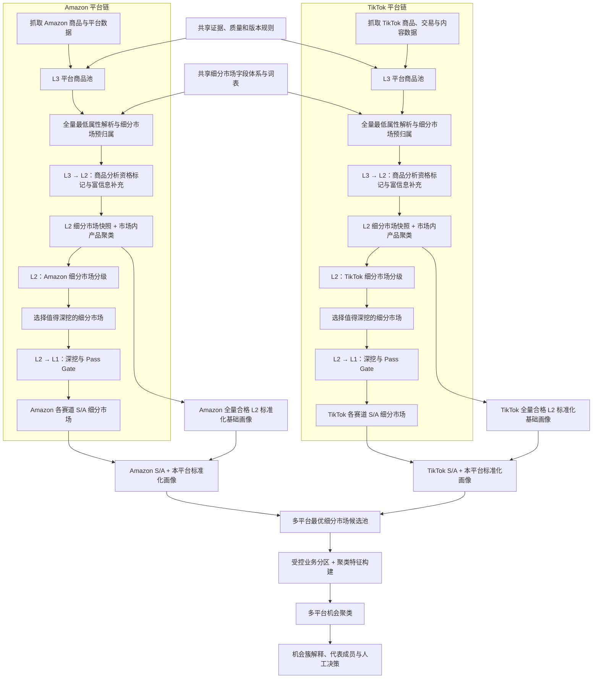

# 最新选品方案：平台独立分析与细分市场归一化规划

> 文档日期：2026-07-24  
> 业务来源：2026-07-24 白板流程图及前序方案讨论  
> 文档性质：目标方案与重构规划，不代表当前代码已经实现  
> 方案状态：目标架构与主流程已确定，关键业务语义、准入策略和参数仍需试点验证  
> 适用对象：项目负责人、选品业务、数据采集团队、算法与开发人员、后续执行 Agent

## 1. 一句话结论

新方案不再把不同平台的原始商品指标提前混在一起评分，而是让 Amazon、TikTok 等平台作为互相隔离的单平台任务，分别完成商品筛选和细分市场分析；系统从 L2 开始以“平台内细分市场”而不是单个商品作为主要分级对象。每个平台先从全量合格 L2 市场快照生成不含赛道语义的标准化基础画像，同时独立运行三赛道 L2/L1/S/A；最终 S/A 只需关联已经存在的基础画像，再进入多平台聚类池。

核心链路为：

```text
平台原始商品
→ 平台内 L3 商品池
→ 全量最低属性解析与细分市场预归属
→ 平台内商品分析资格标记与富信息补充
→ 细分市场快照与市场内产品聚类
  ├→ 全量合格 L2 市场生成标准化基础画像
  └→ 平台内三赛道分级
       → 选择值得深挖的细分市场
       → 细分市场 L1 准入
       → 各赛道 S/A 细分市场
→ S/A 关联已经存在的本平台标准化基础画像
→ 汇总为多平台最优细分市场候选池
→ 按语义属性和机会特征聚类
→ 机会簇解释、产品证据回看与行动建议
```

## 2. 本次方案解决的问题

### 2.1 不同平台原始指标不能直接横向比较

Amazon、TikTok Shop、SHEIN、独立站的字段、统计窗口和业务含义不同。例如 Amazon 的 BSR、搜索需求和评论沉淀，与 TikTok 的视频传播、达人广度、成交速度并不是同一种信号。直接把原始数值放进同一套产品评分，会造成三类问题：

1. 有字段的平台天然占优，缺字段的平台被误判为低分；
2. 同名字段可能口径不同，数值相近也不代表机会相同；
3. 把平台原始指标混合评分，会掩盖各平台自己的竞争结构和用户行为。

因此，新方案只统一数据结构、证据规则和最终结果向量，不统一各平台的原始评分公式。

### 2.2 单个商品不是最稳定的选品决策单位

单品会受到品牌、变体、促销、库存、投放和偶发流量影响。真正需要回答的是：

- 哪一类人，在什么场景下，需要什么物理特性和价格带的产品；
- 这个细分市场在某个平台上的需求、增长、竞争和问题空间如何；
- 哪些平台最优细分市场具有相似的人群需求、产品形态和机会结构；
- 细分市场内部哪些产品能证明机会，哪些产品只属于异常值。

因此，商品继续作为事实和证据载体，但从 L2 起，主要排名和分级对象改为细分市场；最终汇总阶段聚类的对象也是各平台已经筛选出的最优细分市场，而不是商品。

## 3. 白板流程的正式化解释

白板中的 Amazon 和 TikTok 是两条相互独立、结构一致但规则不同的分析链。系统应支持新增其他平台，但不得在平台内分析完成前合并原始指标。

“单平台任务”不是只看平台名称，而是由 `(platform, target_market)` 共同界定。例如 Amazon US 与 Amazon UK 是两个独立任务，分别计算比较类目、时间窗口、分位、Gate 和 S/A。最终聚类也按 `target_market` 硬分区，因此 US 与 UK 结果不会进入同一个机会簇。



### 3.1 两条平台链共享什么

- 细分市场字段定义、受控词表和版本；
- 商品、细分市场、评价结果和证据的数据契约；
- 缺失值、异常值、置信度和人工复核规则；
- 最终归一化结果向量的字段含义；
- 输出格式、审计方式和运行版本管理。

### 3.2 两条平台链不共享什么

- 原始数据准入门槛；
- 平台指标的计算公式；
- 平台内分位和评分阈值；
- L2、L1 的调查重点和预算；
- 平台内 S/A/B/C/D 的产生规则；
- 缺失某个平台特有字段时的处理逻辑。

## 4. L3、L2、L1 与 S/A 的新职责

白板采用 `L3 → L2 → L1` 的收敛方向，与当前代码中的 `L1 → L2 → L3` 命名相反。为避免开发时误接旧逻辑，重构期应同时保存“业务显示名”和“稳定阶段键”。业务文档与界面可以继续显示 L3/L2/L1，代码和数据表优先使用稳定阶段键。

| 白板层级 | 稳定阶段键 | 主要对象 | 主要动作 | 输出 |
|---|---|---|---|---|
| 公共入口 | `SOURCE_AND_L0` | 原始记录、商品观察 | 平台识别、身份校验、证据校验、去重；L0 只做技术合法性检查 | 合法的平台商品观察 |
| L3 | `PLATFORM_PRODUCT_POOL` | 单个平台的商品 | 建立全量候选池，保留原始平台事实 | 平台商品池 |
| L3 全量预归属 | `SEGMENT_ANCHOR_BUILD` | 全量合法商品 | 提取形成主市场所需的最低属性；所有商品进入市场分母 | 初步细分市场归属 |
| L3 → L2 | `PRODUCT_ELIGIBILITY` | 商品 | 使用平台专属低成本规则标记分析资格和富信息补充范围，不物理删除商品 | 商品资格、缺口和补充数据 |
| L2 前置 | `PLATFORM_SEGMENT_SNAPSHOT` | 商品属性与商品关系 | 按全量成员形成市场分母；对合格子集计算深度指标和产品簇 | 平台细分市场快照 |
| L2 | `PLATFORM_SEGMENT_SCREEN` | 平台内细分市场 × 赛道 | 聚合市场规模、增长、竞争、价格、VOC 等，完成平台内初评 | 细分市场平台初评等级 |
| L2 → L1 | `SEGMENT_DEEP_DIVE` | 入围细分市场及其成员商品 | 定向补采、代表商品抽样、异常检查、风险与证据验证 | Pass / Pending / Reject |
| L1 | `QUALIFIED_SEGMENT_POOL` | 通过深挖的细分市场 × 赛道 | 完成 Gate、证据和风险验证，为赛道终评提供依据 | 赛道合格细分市场池 |
| 最终等级 | `FINAL_SEGMENT_TIER` | 平台细分市场 × 赛道 | 平台内终评并绑定证据与置信度 | 各赛道 S/A 细分市场 |

新分级对象的变化是：

```text
L3：处理全量商品，并完成最低限度的细分市场预归属
L3→L2：处理商品分析资格和富信息补充，但保留完整市场分母
L2、L2→L1、L1、S/A：主要处理细分市场 × 赛道
多平台聚类：把各平台最终 S/A 细分市场 × 赛道作为成员，按统一特征形成机会簇
```

商品不会从系统中消失。它在 L2 以后承担四种角色：细分市场成员、代表商品、异常商品和建议举例，但不再独自决定细分市场最终等级。

### 4.1 两条耦合状态流与字段命名

标准化基础向量属于“平台 × 目标市场 × 细分市场”，三赛道评价属于“平台 × 目标市场 × 细分市场 × 赛道”。两条状态流从同一个市场快照出发，最终在聚类入池时关联：

```text
PlatformSegmentSnapshot
  ├→ NORMALIZED_PROFILE_READY（每个细分市场一份基础向量）
  └→ L2_EVALUATED（每条赛道一份评价）
       └→ L1_GATE_PASS | L1_GATE_PENDING | L1_GATE_REJECTED
            └→ FINAL_TIERED（仅 PASS）

NORMALIZED_PROFILE_READY + 任一赛道 FINAL_TIERED=S/A
→ ENTER_MULTI_PLATFORM_CLUSTER_POOL
→ MULTI_PLATFORM_CLUSTERED
```

各阶段字段不得复用同一个 `grade`：

| 字段 | 含义 |
|---|---|
| `l2_raw_score` | 平台专属 L2 原始分，只能在该平台规则内解释 |
| `l2_platform_grade` | 平台 L2 初评等级，例如 A/B/C/D/E |
| `l2_platform_percentile` | 在冻结参考总体中的平台内分位 |
| `l1_gate_status` | `PASS / PENDING_DATA / REJECTED` |
| `track_final_tier` | L1 Pass 后，该赛道的 S/A；未通过时为空 |
| `normalized_dimension_scores` | 细分市场共用的标准化基础向量，不含赛道综合分 |
| `reference_population_id` | 该基础向量使用的平台、目标市场、类目和窗口参考总体 |

本文所称“平台 S/A 细分市场”，均是“该平台至少有一条赛道得到 S/A”的简写。正式数据和多平台聚类成员必须保留 `track_id`，不默认把三赛道合成一个综合 S/A。

### 4.2 操作术语

| 术语 | 操作定义 |
|---|---|
| L0 | 只检查身份、平台、URL、证据和全局红线，不做业务评分 |
| 同类目 | 同一平台配置中明确的比较组，不以标题相似临时决定 |
| 统一时间窗口 | 本轮配置冻结的起止时间和统计粒度，所有分位引用同一窗口 |
| `evidence_coverage` | 要求维度中具有合法证据的比例 |
| `confidence` | 综合样本量、证据质量、分类置信度和缺失情况后的可信程度 |
| 强/弱 | 由版本化阈值或分位定义，不允许在正式结论中仅用自然语言判断 |
| 未成熟 | 有方向性信号但未通过 L1 Gate 或关键窗口不足 |
| 聚类成员 | 一个带平台、细分市场、赛道、最终等级和统一特征的 S/A 结果 |
| 噪声点 | 与其他成员相似度不足、未被算法强制归入任何机会簇的成员 |

## 5. 细分市场模型

### 5.1 细分市场不是自由文本标签

细分市场必须由版本化字段体系生成，不能让 Agent 每轮自由命名。第一版至少覆盖以下字段组：

| 字段组 | 示例 | 说明 |
|---|---|---|
| 基础类目 | 连衣裙、上装、塑身衣 | 确定分析边界，不作为唯一细分依据 |
| 适用人群 | 性别、年龄/生命周期、体型、特殊需求 | 只使用输入证据可支持的范围 |
| 使用场景 | 日常、通勤、派对、度假、运动、居家、婚礼 | 支持多值，但必须区分主场景和次场景 |
| 产品物理特性 | 版型、廓形、领型、袖长、长度、材质、弹力、结构 | 服饰与百货使用不同字段模板 |
| 风格与设计元素 | Casual、Elegant、Lace、Ruffle、Print 等 | 作为市场区分和聚类特征 |
| 功能或问题 | 塑形、支撑、防滑、透气、尺码包容等 | 来自详情、评论或明确属性证据 |
| 价格带 | 平台币种价格带、平台内价格分位 | 同时保留绝对价格和平台内相对位置 |
| 时效属性 | 季节、节日、新品窗口 | 必须绑定时间证据，不能仅凭标题猜测 |

### 5.2 主细分市场与辅助标签

为避免属性组合爆炸，每个商品采用以下关系：

- 一个 `primary_segment_id`：用于市场聚合、排名和分级；
- 零到多个 `secondary_segment_ids`：用于交叉查询和边界商品复核；
- 一组独立 `attribute_tags`：用于筛选和解释，不直接生成新的细分市场；
- 一条 `membership_confidence` 和证据引用；
- 低置信度或多个主市场难以区分时进入 `PENDING_REVIEW`，不强行归类。

细分市场归属采用两段式成本控制：

1. L3 全量商品只提取形成主市场所需的最低字段，确保完整市场分母；
2. 只有获得分析资格或进入代表样本的商品，才补充图片、评论、复杂物理属性和深度关系。

商品初筛只能改变 `analysis_eligibility`，不能把商品从市场成员快照中删除。报表同时展示全量成员数、合格分析成员数、被过滤成员分布和抽样复核结果，防止只用“幸存商品”推断整个市场。

### 5.3 细分市场与产品聚类必须分开

白板中的“细分类、聚类”是两个连续动作，不是同一个概念：

1. **细分市场分类**：根据受控业务字段决定商品属于哪个需求市场；
2. **市场内产品聚类**：在同一细分市场内部，根据款式、图片、物理特性、价格和问题信号形成若干产品簇。

例如，“女性度假场景、方领、Midi、轻薄价格带连衣裙”可以是一个细分市场；其内部还可以有碎花、纯色、泡泡袖等产品簇。分级针对前者，聚类用于解释市场结构和抽取代表产品。

### 5.4 稳定标识与版本

每个细分市场至少保存：

```text
segment_id
taxonomy_version
segment_name_cn
segment_definition
required_dimensions
optional_dimensions
parent_segment_id
status
created_at
approved_by
```

细分市场的正式身份为 `(taxonomy_version, segment_id)`。在同一 taxonomy 版本内，`segment_id` 稳定；发生合并、拆分或定义调整时产生新版本并保存 lineage。历史运行继续引用原版本，不能用新定义覆盖旧结论。聚类成员可以来自不同 `segment_id`，因为聚类目的正是发现不同细分市场之间的相似机会形态；但同一次正式聚类必须使用同一 taxonomy 版本，跨版本只能先经过业务批准的字段映射。

## 6. LLM 的职责与边界

LLM 只负责语义解析和受控分类，不直接决定分数或等级。

### 6.1 允许 LLM 执行

- 从标题、详情、结构化属性、图片和评论中提取受控字段；
- 给出主细分市场、辅助细分市场和属性标签候选；
- 解释分类依据并返回证据引用；
- 对低置信度、信息冲突或词表外概念提出人工复核项；
- 在同一细分市场内部生成产品相似关系候选。

### 6.2 不允许 LLM 执行

- 编造销量、价格、上架时间、评论结论或缺失属性；
- 自行创建未经审批的新字段和正式细分市场；
- 用常识填补输入中不存在的事实；
- 直接输出平台 S/A/B/C/D；
- 无证据地认定两个平台商品为同款；
- 覆盖确定性规则计算出的平台指标和等级。

### 6.3 每次语义输出必须包含

```text
product_id
taxonomy_version
primary_segment_id
secondary_segment_ids[]
attributes{}
evidence_refs[]
confidence
missing_fields[]
conflicts[]
model_id
prompt_version
review_status
```

回灌前由确定性校验器检查词表、证据白名单、字段类型和置信度。校验失败的结果保留原始输出和错误原因，但不能进入正式细分市场统计。

## 7. 平台内细分市场分析

### 7.1 Amazon 分析重点

Amazon 的平台分析器优先使用：

- 搜索需求、销量、销售额、BSR 和趋势；
- 评论量、评分、负面问题和退货相关证据；
- 卖家、品牌、头部集中度和上架结构；
- 价格带、促销、变体和评论沉淀；
- 细分市场内需求稳定性、竞争可切入性和改款空间。

SellerSprite 继续承担 Amazon 需求和竞争判断，Amazon 前端数据用于商品详情、图片、属性和页面证据补充。两者属于同一平台事实链，不需要和 TikTok 原始指标换算。

### 7.2 TikTok 分析重点

TikTok 的平台分析器优先使用：

- 销量、GMV、成交速度和多周期增长；
- 视频数量、播放、互动、达人广度和内容扩散；
- 商品、店铺、达人和内容集中度；
- 价格带、促销、评论和问题反馈；
- 细分市场的内容驱动强度、成交承接能力和热度持续性。

内容热度和真实成交必须分开。只有内容信号的细分市场可以作为趋势观察对象，但不能被写成需求已经验证。

### 7.3 平台等级允许不同

白板中 Amazon 侧出现 A/B/C/D/E，TikTok 侧出现 A/B/C。规划允许不同平台在 L2 使用不同等级数量，因为这些等级只用于平台内部排序。

每个平台的 L2 结果必须同时输出：

- `l2_raw_score`：平台规则产生的原始分；
- `l2_platform_grade`：平台内部初评等级；
- `l2_platform_percentile`：同平台、同类目、同时间窗口的分位；
- `evidence_coverage`：关键维度证据覆盖率；
- `confidence`：结果可信度；
- `missing_dimensions[]`：不可用于判断的维度。

最终聚类不能直接消费 `l2_raw_score` 或 `l2_platform_grade`。L1 Gate 通过后，系统另行产生该赛道的 `track_final_tier=S/A`；两个阶段的 A 不得写入同一个字段。进入聚类的是平台内归一化后的特征向量，不是平台原始等级本身。

## 8. 三赛道在新方案中的位置

三赛道不再直接对全平台混合商品产生最终等级，而是成为“平台内细分市场的三种机会解释视角”。正式评价主键调整为：

```text
(run_id, platform, target_market, taxonomy_version, segment_id, track_id)
```

| 赛道 | 新的评价对象 | 主要问题 |
|---|---|---|
| 新品/趋势 | 平台细分市场 | 该细分市场是否近期形成、增长或出现新特性组合 |
| 爆款/改款 | 平台细分市场 | 该细分市场是否已有需求，但存在普遍且可解决的问题 |
| 长尾 | 平台细分市场 | 该细分市场是否具有稳定需求、可切入竞争和持续经营价值 |

同一平台细分市场可以在多个赛道中得到结果。例如，一个新形成的细分市场既可能是“趋势 A”，也可能因大量尺码问题成为“改款 B”。三赛道分别保留分数、证据、缺口和深挖队列，最终由人确认开发方式。

S/A 按赛道独立产生，不设置自动综合等级。展示层可以把“任一赛道 S/A”的市场汇总到一张候选表，但必须并列展示每条赛道的 `track_final_tier`，不能用最高等级覆盖其他赛道。多平台聚类成员的正式键为：

```text
(run_id, platform, target_market, taxonomy_version, segment_id, track_id, normalization_version)
```

商品级三赛道结果可作为迁移期审计信息保留，但不再是新方案的最终事实源。

## 9. L2 → L1 的选择性深挖

L2 不对所有细分市场做同等成本的深入调查。每个平台根据本平台的 L2 结果选择值得进一步分析的市场，并为每个市场制定定向补采计划。

### 9.1 深挖对象

- L2 高等级或高分位细分市场；
- 分数高但关键证据不足的细分市场；
- 多个信号冲突、可能被异常商品拉高的细分市场；
- 业务指定观察的战略细分市场；

### 9.2 成员商品抽样

每个入围细分市场至少抽取以下代表商品，而不是只看销量最高的几个商品：

- 头部需求商品；
- 增长最快商品；
- 市场中位商品；
- 低评分或负面问题代表商品；
- 新品代表商品；
- 价格带上下边界商品；
- 被识别为异常值的商品。

### 9.3 L1 Gate

L2 细分市场只有满足以下条件才进入 L1：

1. 细分市场定义稳定，成员不是由错误分类临时拼成；
2. 核心平台指标具有足够样本和统一时间窗口；
3. 高分不是由单个异常商品或单次投放造成；
4. 关键证据可追溯，缺失维度没有被填成 0；
5. 风险、季节和价格条件可以判断；
6. 本赛道的最低事实条件成立；
7. 结果经过配置化 Gate，必要时完成人工复核。

Gate 状态使用 `PASS / PENDING_DATA / REJECTED`。只有 `PASS` 可以形成平台 S/A 细分市场；`PENDING_DATA` 单独进入补采池，不得伪装成 B。

单平台任务必须保持硬隔离：Amazon 的 L3、L2、L1、补采、Gate 和 S/A 不得读取 TikTok 的结果，TikTok 也不得读取 Amazon 的结果。多平台数据只能在各平台最终 S/A 产出后进入聚类池，不能反向影响任何平台分数或等级。

## 10. 多平台聚类前的结果标准化

### 10.1 归一化原则

标准化的对象是平台细分市场快照及其中不含赛道语义的公共平台指标，不是三赛道评价结果，也不是原始商品字段。所有合格 L2 市场先在本平台参考总体中生成 `NormalizedSegmentProfile`，三赛道评价与此并行；S/A 只决定哪些成员最终关联该 Profile 后进入多平台聚类池，不能反过来充当分位参考总体。标准化必须满足：

- 先在平台内计算，再转换为统一方向；
- 同平台、同类目、同时间窗口计算分位；
- 高值代表机会更好的维度统一为正向；
- 竞争、风险等反向指标先完成方向转换；
- 缺失保持 `null` 并记录原因，不能用 0 或平台均值代替；
- 货币、时间窗和样本边界必须版本化；
- 归一化版本与平台规则版本同时写入结果。

每次归一化必须冻结并保存：

```text
reference_population_id
platform
target_market
category_group
window_start
window_end
population_size
inclusion_rule_version
normalization_version
```

参考总体是该平台、该目标市场、该比较类目、该窗口内满足最小合法性要求的全量 L2 市场，不能只包含 S/A，也不能在结果发布后悄悄改变。

### 10.2 统一结果向量

每个平台的合格 L2 细分市场都转换为以下统一基础向量；向量本身不区分赛道，其中任一 `track_final_tier=S/A` 的市场会在聚类入池时关联对应的赛道评价：

```text
demand_strength              需求强度
demand_growth                需求增长
demand_stability             需求稳定性
competition_opportunity      竞争可切入性
price_profit_room            价格与利润空间
content_resonance            内容共振
product_improvement_room     产品改良空间
freshness_novelty            新鲜度与新颖性
risk_control                 风险可控度
evidence_confidence          证据可信度
```

不是每个平台都必须拥有全部维度。基础向量逐维保留标准化值、分位、缺失状态和证据置信度，不在本层计算跨维度综合分。进入按 `track_id` 划分的聚类分区后，才由该赛道的聚类配置决定哪些维度参与距离以及各自权重。

第一版平台映射框架如下，具体字段、公式、窗口和最低样本在 P0 配置表中冻结：

| 统一维度 | Amazon 主要来源 | TikTok 主要来源 | 统一方向 | 缺失时处理 |
|---|---|---|---|---|
| 需求强度 | 销量、销售额、BSR、搜索需求 | 销量、GMV、成交商品广度 | 越高机会越强 | 保持 null；需求型赛道不得确证 |
| 需求增长 | 多周期销量/排名/搜索变化 | 多周期 GMV、销量和内容变化 | 稳健增长越高越强 | 保持 null；不得用单点代替趋势 |
| 需求稳定性 | 多周期成交与排名波动 | 多周期成交与内容承接 | 越稳定越强 | 窗口不足时标未成熟 |
| 竞争可切入性 | 卖家/品牌集中、同市场商品与价格结构 | 店铺/达人/商品集中、价格结构 | 可切入越强越高 | 保持 null；不由商品数单项决定 |
| 价格利润空间 | 价格分布、促销、可得成本证据 | 价格分布、促销、可得成本证据 | 空间越大越强 | 无成本证据时只写价格空间 |
| 内容共振 | 可得内容/外部信号 | 视频、达人、互动和内容广度 | 自然扩散越强越高 | Amazon 缺失不扣 0 分 |
| 产品改良空间 | 评分、评论与问题聚类 | 评论、退货/内容反馈与问题聚类 | 可解决问题越明确越高 | 无 VOC 时不得确证改款 |
| 新鲜度与新颖性 | 上架、新品位、搜索/款式稀有度 | 上架、内容首次出现和增长 | 近期且新颖越高越强 | 时间证据不足时标待补 |
| 风险可控度 | IP、品牌、季节、异常和合规证据 | IP、内容依赖、季节、异常和合规证据 | 风险越可控越高 | 关键风险未知时限制等级 |

置信度约束至少包括：最小市场样本、全量成员覆盖、合法证据覆盖、时间窗口完整性和分类一致性。缺关键需求维度、样本不足或关键风险未知时必须影响单平台 Gate 或 S/A 上限；聚类阶段不得通过重新分配距离权重绕过这些限制。

### 10.3 推荐的标准化基础画像

```text
normalized_dimension_scores{}
dimension_percentiles{}
evidence_confidence
missing_dimensions[]
reference_population_id
normalization_version
```

标准化基础画像只负责提供可进入统一距离空间的逐维特征，不产生新的总分或字母等级。平台原始等级仍保留，不被覆盖。聚类池只接收各平台最终 S/A 成员，但审计表必须保留所有平台等级与未入围原因。

## 11. 多平台最优细分市场聚类

最终阶段不做 Amazon 与 TikTok 的一一对照，也不要求不同平台存在相同 `segment_id`。系统把所有单平台任务最终产生的 S/A 细分市场汇总为成员池，按照“它们属于什么需求和产品形态、表现出什么机会结构”进行聚类。

聚类回答的是：哪些最优细分市场具有相似的业务机会形态，可以被放在一起理解、继续调查或制定共同策略。聚在一起不等于它们是同一细分市场、同款商品或可以直接合并经营。

### 11.1 聚类输入池

聚类池取各平台最终结果的并集，每个成员必须满足：

```text
l1_gate_status = PASS
track_final_tier in [S, A]
taxonomy_version = 本轮聚类指定版本
normalized_dimension_scores 已完成
evidence_coverage 与 confidence 达到最低要求
```

成员唯一键为：

```text
(run_id, platform, target_market, taxonomy_version, segment_id, track_id, normalization_version)
```

同一个细分市场如果在两个赛道分别得到 S/A，会作为两个带不同 `track_id` 的业务成员保留。平台字段用于结果描述和来源追溯，不参与相似度计算，避免算法只按平台分组。

### 11.2 先做业务硬分区

聚类前先按以下字段分区，禁止把业务含义明显不同的成员强行放在同一簇：

1. `taxonomy_version`：同一聚类运行只处理同一词表版本；
2. 一级业务类目：例如连衣裙、塑身衣、百货器物不混聚；
3. `track_id`：趋势、改款、长尾分别聚类，不自动合并机会逻辑；
4. `target_market`：只有统计口径和经营目标一致时才允许进入同一分区。

平台不是硬分区。一个聚类可以同时包含 Amazon、TikTok 和后续新增平台，也可以只包含单个平台的成员。单平台集中只说明该机会形态当前在该平台结果中更集中，不代表其他平台被判为更弱。

### 11.3 聚类特征

每个成员由两类特征组成：

**业务语义特征**：

- 适用人群、主场景和次场景；
- 产品物理特性、风格、设计元素、功能或问题；
- 平台内价格分位和统一价格带；
- 季节、节日、新鲜度类型；
- 细分市场的代表属性与产品簇摘要。

**机会结构特征**（来自细分市场共用的 `NormalizedSegmentProfile`）：

- `demand_strength`、`demand_growth`、`demand_stability`；
- `competition_opportunity`、`price_profit_room`；
- `content_resonance`、`product_improvement_room`；
- `freshness_novelty`、`risk_control`；
- `evidence_confidence` 和样本稳定性。

禁止直接放入相似度计算的字段包括：平台名称、平台原始销量、原始 GMV、原始 BSR、`l2_raw_score`、平台内部字母等级和商品标题全文。它们可以用于解释聚类成员，但不能主导聚类距离。

### 11.4 推荐的聚类方法

第一版建议采用“混合特征距离 + HDBSCAN”的方案：

1. 受控枚举使用相等/不等距离，多值标签使用 Jaccard 距离；
2. 数值型统一向量使用缩放后的绝对距离；
3. 缺失值只在双方均可观测的维度上计算，并附加覆盖率惩罚；
4. 按 Gower distance 思路合成一条可解释的混合距离；
5. HDBSCAN 使用预计算距离聚类，不预设簇数量，并允许低相似成员成为噪声点；
6. 每个簇选择实际成员中的 medoid 作为代表，不凭空生成“平均细分市场”。

选择 HDBSCAN 的原因是最终 S/A 成员数量和机会簇数量事先未知，而且不应为了报表完整把所有成员强行归类。若某个硬分区样本不足以稳定运行 HDBSCAN，则在试点阶段使用层次聚类辅助人工观察，并明确标记为 `PILOT_ONLY`，不能与正式聚类混用。

聚类配置至少版本化以下参数：

```text
clustering_version
feature_schema_version
distance_weights_by_track
min_cluster_size
min_samples
missing_penalty
noise_policy
random_seed_or_determinism_note
```

### 11.5 聚类结果与解释

每个机会簇至少输出：

- `cluster_id`、`clustering_version` 和成员快照；
- 业务分区：taxonomy、一级类目、赛道和目标市场；
- 代表成员 medoid 与其他核心成员；
- 成员到 medoid 的距离、membership strength 和噪声状态；
- 共同的人群、场景、物理特性和机会结构；
- 平台构成、成员等级和价格带分布，仅作描述；
- 每个成员的代表商品和证据引用；
- 聚类稳定度、样本量、覆盖率和风险；
- Agent 生成的机会簇名称与摘要草稿；
- 人工确认的簇名称、优先级和后续动作。

聚类结果不得输出“Amazon 胜过 TikTok”或“某平台更好”的结论。平台构成只用于解释来源，最终建议针对机会簇及其成员适用条件。聚类也不自动等同于商品立项、产品定义、采购、合规通过或刊登决策。

## 12. 核心数据对象

### 12.1 `PlatformProductObservation`

表示某个平台上的一个商品观察。唯一键建议为：

```text
(run_id, platform, target_market, product_id)
```

保留平台原始字段、标准字段、采集时间、来源、证据和缺失原因。不同平台的商品不得在此层因标题相似而合并。

### 12.2 `ProductSemanticProfile`

保存 LLM 受控属性提取结果、词表版本、证据、置信度和复核状态。

### 12.3 `SegmentMembership`

保存商品与细分市场的主/次关系。唯一键建议为：

```text
(run_id, platform, target_market, product_id, taxonomy_version, segment_id, membership_type)
```

### 12.4 `PlatformSegmentSnapshot`

保存某次运行中某个平台细分市场的成员快照、聚合指标、分布、产品簇和异常值。唯一键建议为：

```text
(run_id, platform, target_market, taxonomy_version, segment_id)
```

### 12.5 `PlatformSegmentEvaluation`

保存平台细分市场在某个赛道中的 L2、L1 和最终等级摘要。唯一键建议为：

```text
(run_id, platform, target_market, taxonomy_version, segment_id, track_id)
```

摘要对象使用 `l2_platform_grade`、`l1_gate_status` 和 `track_final_tier` 分字段保存，不互相覆盖；另外维护带 `stage` 和时间戳的追加式状态事件，用于审计状态变化。

### 12.6 `NormalizedSegmentProfile`

保存平台细分市场共用的逐维标准化值、逐维分位、缺失维度、证据置信度、参考总体和标准化版本，不包含 `track_id`，也不产生新的综合等级。唯一键包含 `(run_id, platform, target_market, taxonomy_version, segment_id, normalization_version)`。

### 12.7 `MultiPlatformSegmentCluster`

保存多平台 S/A 细分市场成员形成的机会簇、业务分区、聚类版本、medoid、成员距离、稳定度、噪声点、代表商品、解释草稿和人工结论。唯一键建议为 `(cluster_run_id, clustering_version, cluster_id)`；成员表另存 `PlatformSegmentEvaluation` 完整键、关联的 `NormalizedSegmentProfile` 键和 membership strength。

## 13. 与当前系统的关系

当前主链的事实对象和评价对象仍以 `CandidateDataPacket`、商品级 `TrackEvaluation` 为主，并在较晚阶段执行多来源商品比对。新方案的主要变化如下：

| 当前系统 | 新方案 |
|---|---|
| 多来源较早合并为候选商品事实包 | 各平台作为独立任务完成 L3/L2/L1/S/A，最终才汇总最优细分市场 |
| 商品 × 三赛道评估 | 平台细分市场 × 三赛道评估 |
| L1 → L2 → L3 | 白板业务流为 L3 → L2 → L1，代码使用稳定阶段键避免混淆 |
| S/A/B 主要描述商品机会 | S/A 主要描述平台细分市场机会 |
| 终局多来源处理聚焦商品匹配与对照 | 终局处理改为多平台最优细分市场聚类，商品只作为成员证据 |
| 画像只对部分深评商品提取 | 细分所需的核心语义字段在进入 L2 前提取 |
| 趋势词体系与商品赛道相对独立 | 趋势字段可参与细分市场和趋势赛道，但继续保留证据边界 |

以下现有能力可以复用：

- `SourceEnvelope` 的来源和证据框架；
- 平台 Adapter 和原始工作簿解析；
- 受控词表画像提取及 LLM 回灌校验；
- 缺失字段、证据引用和运行版本管理；
- 三赛道的独立评价思想；
- SQLite、XLSX、JSONL 和 MCP 查询基础。

以下能力需要重构或新增：

- 平台隔离的商品观察层；
- 细分市场词表、版本和治理；
- 商品到细分市场的主/次关系；
- 细分市场聚合、产品簇和异常值处理；
- 平台细分市场级三赛道评估；
- 平台结果归一化；
- 多平台 S/A 细分市场候选池、混合特征距离和机会聚类；
- 新旧 L 层级的兼容映射和切换机制。

## 14. 实施阶段

### 阶段 P0：冻结业务语义与数据契约

目标：先解决“大家说的是不是同一件事”。

交付物：

- L3/L2/L1 与稳定阶段键映射表；
- `platform + target_market` 单平台任务身份与运行边界；
- 第一版细分市场字段字典和受控词表；
- `segment_id`、版本和 lineage 规则；
- 七个核心数据对象的 schema；
- Amazon、TikTok 原始指标和统一维度映射表；
- 缺失值、置信度、证据和人工复核规则；
- 新旧系统并行运行和退出条件。

验收：先用同一类目的 30 至 50 个样例商品完成 pilot，由业务和系统独立分类时，主要字段、主细分市场和边界争议均可解释并留痕。该样本只证明流程可行，不足以证明 taxonomy 已对多类目稳定。

### 阶段 P1：细分市场生成 MVP

目标：让商品稳定地产生语义画像、主细分市场和市场内产品簇。

交付物：

- Amazon、TikTok 商品语义输入适配；
- LLM 受控提取任务、输出校验和回灌；
- `SegmentMembership` 与 `PlatformSegmentSnapshot`；
- 低置信度人工复核队列；
- 细分市场成员、属性分布和代表商品报表。

验收：不能识别的商品进入待复核，不得静默落入“其他”；同一商品重复运行时，在词表和输入不变的情况下结果可重放；使用多类目留出集验证边界市场，并完成重复运行一致性、稀疏市场及拆分/合并压力测试。

### 阶段 P2：平台专属细分市场分析

目标：分别形成 Amazon 和 TikTok 的 L2 细分市场结果。

交付物：

- Amazon 细分市场指标、评分、等级和分位；
- TikTok 细分市场指标、评分、等级和分位；
- 细分市场样本量、分布、异常值和证据覆盖；
- 三赛道在平台细分市场上的独立评估；
- 平台内补采和深挖预算队列。

验收：修改 TikTok 规则不得改变 Amazon 原始等级；缺失平台特有字段不得影响另一平台运行。

### 阶段 P3：L2 → L1 深挖与 S/A 终评

目标：只对值得分析的细分市场投入深挖成本。

交付物：

- 代表商品分层抽样器；
- 细分市场定向补采任务；
- `PASS / PENDING_DATA / REJECTED` Gate；
- 平台 S/A 细分市场表；
- 人工复核和批准记录。

验收：每个 S/A 结论都能回到平台指标、成员商品和原始证据；单个异常商品不能独自把市场推到 S/A。

### 阶段 P4：标准化与多平台机会聚类

目标：为各平台全量合格 L2 市场建立统一向量，将各单平台最终 S/A 汇入候选池并形成可解释的机会簇。

交付物：

- `NormalizedSegmentProfile` 与标准化版本；
- 多平台 S/A 细分市场成员池；
- 业务硬分区、混合特征距离和 HDBSCAN 配置；
- 机会簇、medoid、membership strength 和噪声点；
- 机会簇解释、代表成员和代表商品；
- 聚类稳定度报告、建议卡和人工决策页。

验收：聚类不使用未经标准化的平台原始分数或平台名称作为距离特征；任一聚类特征都可追溯到平台规则和事实证据；低相似成员允许保留为噪声点。

### 阶段 P5：校准、并行验证与切换

目标：通过历史样本和真实运行证明新方案可用，再替换旧商品级事实源。

交付物：

- 历史成功、失败、边界样本金标集；
- 新旧结果差异报告；
- 阈值、预算和归一化权重校准记录；
- 回滚方案和正式切换清单；
- 旧商品级 `TrackEvaluation` 的审计保留策略。

验收：业务确认新结果的可解释性和行动价值；正式切换前至少完成多轮并行运行，不用一次样本直接拍板生产阈值。

## 15. 关键验收标准

1. Amazon 与 TikTok 是独立单平台任务，在各自 S/A 产出前不得互相读取结果；
2. 每个正式商品都有平台、目标市场、主细分市场、词表版本、证据和置信度；
3. L2 起主要评价对象是平台细分市场，不是单个商品；
4. 细分市场分类和市场内产品聚类是两个可独立审计的步骤；
5. 三赛道评价主键包含 `platform + target_market + taxonomy_version + segment_id + track_id`；
6. `PENDING_DATA` 与 `REJECTED` 不得混入 B；
7. L2 平台等级、逐维平台分位、`NormalizedSegmentProfile` 和赛道最终 S/A 同时保留；
8. 缺失值保持缺失，不能用 0、均值或 LLM 推断补齐；
9. 每个机会簇都能回到全部成员、成员统一向量、代表商品和原始证据；
10. 新旧层级语义有明确映射，不允许同一个 `L2` 在不同模块表示相反含义；
11. 任何 S/A 细分市场都经过 L1 Gate 和必要的人审；
12. 推荐结果不自动越权为立项、采购、合规或刊登结论。

## 16. 主要风险与控制

| 风险 | 表现 | 控制方式 |
|---|---|---|
| 细分市场爆炸 | 属性组合过多，市场样本过小 | 一个主市场 + 辅助标签；设最小样本；词表变更需审批 |
| LLM 分类漂移 | 同一商品多轮归类不同 | 固定词表、模型和提示版本；确定性校验；金标回归 |
| 平台强行等价 | 原始销量、热度或等级直接进入同一聚类距离 | 只使用标准化语义与机会向量；平台原始结论单独保留 |
| 小样本高分 | 少量商品或单个爆品拉高市场 | 输出样本量和分布；稳健统计；L1 异常 Gate |
| 热度冒充需求 | TikTok 内容高但成交未验证 | 内容与交易维度分离；结论明确标注证据类型 |
| 标准化掩盖缺失 | 字段少的平台被生成看似完整的基础向量 | 缺失为 null；逐维显示覆盖率；置信度约束赛道 S/A 上限与聚类距离 |
| 细分定义漂移 | 市场合并/拆分后历史不可解释 | taxonomy 版本与 lineage；历史结果不回写 |
| 新旧层级接错 | L1/L2/L3 方向相反导致错误调用 | 使用稳定阶段键；兼容层显式映射；契约测试 |
| 聚类伪相似 | 只因标题或单个高分维度被聚在一起 | 业务硬分区；混合特征距离；medoid 与成员距离审计 |
| 平台主导聚类 | 平台字段或平台特有指标让结果按来源分组 | 平台不进距离；平台特有原始指标先映射统一维度 |
| 强制归类 | 所有 S/A 都被塞入某个簇 | 使用允许噪声点的算法；噪声单独输出和人工复核 |
| 聚类漂移 | 参数或成员变化导致机会簇无法追溯 | 保存聚类版本、成员快照、medoid、稳定度和 lineage |

## 17. 待业务确认项

以下项目不阻碍架构规划，但必须在开发相应阶段前确认：

1. Amazon L2 使用 A/B/C/D/E、TikTok L2 使用 A/B/C，还是统一平台内等级数量；
2. 哪些字段必须进入 `primary_segment_id`，哪些只作为辅助标签；
3. 一个商品允许多少个辅助细分市场，以及何时必须人工复核；
4. 细分市场最小成员数、稀疏市场合并和“其他”市场规则；
5. 各平台 L2 入围、L1 深挖和 S/A 的预算；
6. 三赛道是否全部对所有平台细分市场运行，还是按平台开启；
7. 逐维标准化规则、最低样本、置信度封顶和各赛道最终 S/A 阈值；
8. 聚类各特征权重、`min_cluster_size`、`min_samples`、噪声处理和小样本降级规则；
9. 机会簇的人工命名、优先级和拆分/合并审批流程；
10. 旧商品级三赛道结果的并行保留周期和正式下线条件。

## 18. 推荐的第一步

不要先改评分代码。第一步应完成 P0 pilot：选取 Amazon 与 TikTok 同一大类目的 30 至 50 个真实商品，在 pilot 范围内冻结细分市场字段和第一版词表，由业务人工给出主细分市场金标，再验证 LLM 受控解析与商品归属。pilot 通过后，还要使用多类目留出集检验细分市场拆分、合并和边界稳定性。只有细分市场定义达到可接受稳定度后，平台聚合、L2 分级、L1 深挖、结果标准化和最终多平台聚类才有可靠的计算对象。
